# Implementación DevOps — Demo NodeJS

Documento técnico sobre la dockerización de la aplicación, el pipeline CI/CD, el proceso de despliegue en Kubernetes y las decisiones tomadas durante la implementación.

---

## Tabla de contenidos

1. [Arquitectura general](#1-arquitectura-general)
2. [Dockerización](#2-dockerización)
3. [Pipeline CI/CD](#3-pipeline-cicd)
4. [Smoke Test con k3d](#4-smoke-test-con-k3d)
5. [Historial de despliegue — decisiones y obstáculos](#5-historial-de-despliegue--decisiones-y-obstáculos)
6. [Infraestructura en Oracle Cloud](#6-infraestructura-en-oracle-cloud)
7. [Deploy a Kubernetes desde GitHub Actions](#7-deploy-a-kubernetes-desde-github-actions)
8. [Manifiestos Kubernetes](#8-manifiestos-kubernetes)
9. [Estado actual y pasos pendientes](#9-estado-actual-y-pasos-pendientes)

---

## 1. Arquitectura general

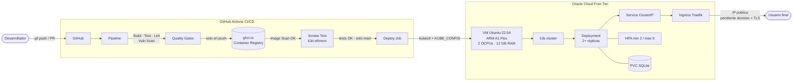

---

## 2. Dockerización

### 2.1 Estrategia multi-stage build

El `Dockerfile` utiliza **tres etapas** para producir una imagen final mínima y sin dependencias de desarrollo.

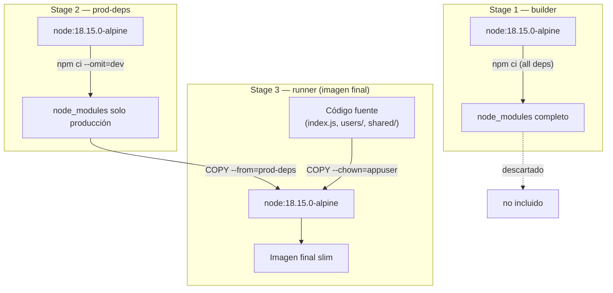

### 2.2 Decisiones de seguridad

| Decisión | Implementación | Motivación |
|---|---|---|
| Usuario no-root | `adduser appuser` + `USER appuser` | Principio de mínimo privilegio |
| Imagen base alpine | `node:18.15.0-alpine` | Superficie de ataque reducida |
| `COPY --chown` | Archivos pertenecen a `appuser` | Evita archivos accesibles por root |
| Health check | `wget -qO- http://localhost:8000/api/users` | Kubernetes detecta pods no saludables |
| Volumen declarado | `VOLUME ["/app/data"]` | SQLite persiste fuera de la imagen |

### 2.3 Variables de entorno

| Variable | Valor por defecto | Descripción |
|---|---|---|
| `NODE_ENV` | `production` | Modo de ejecución de Node.js |
| `DATABASE_NAME` | `/app/data/db.sqlite` | Ruta al archivo SQLite |
| `DATABASE_USER` | `user` | Usuario de la base de datos |
| `DATABASE_PASSWORD` | `password` | Contraseña de la base de datos |

En Kubernetes se inyectan desde **ConfigMap** (valores no sensibles) y **Secret** (credenciales).

---

## 3. Pipeline CI/CD

### 3.1 Disparadores

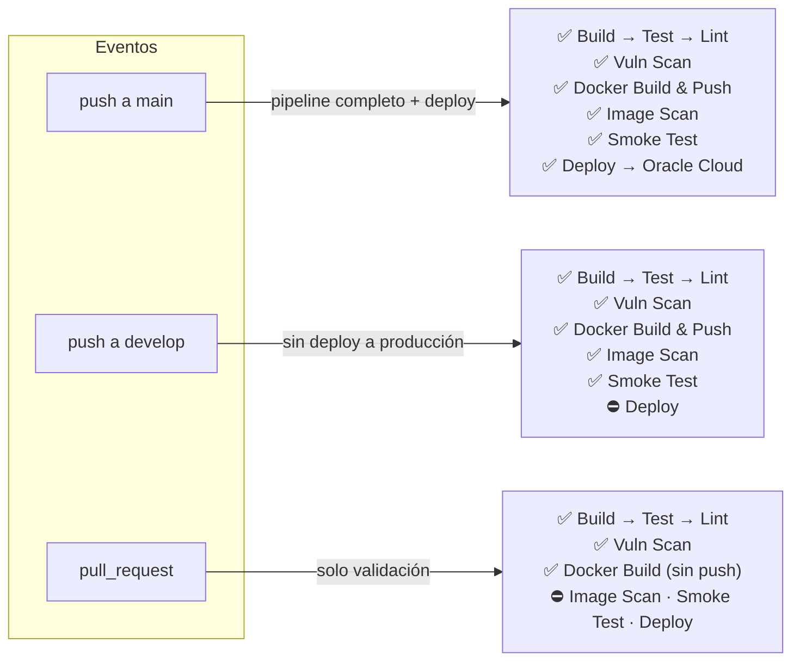

### 3.2 Flujo de jobs

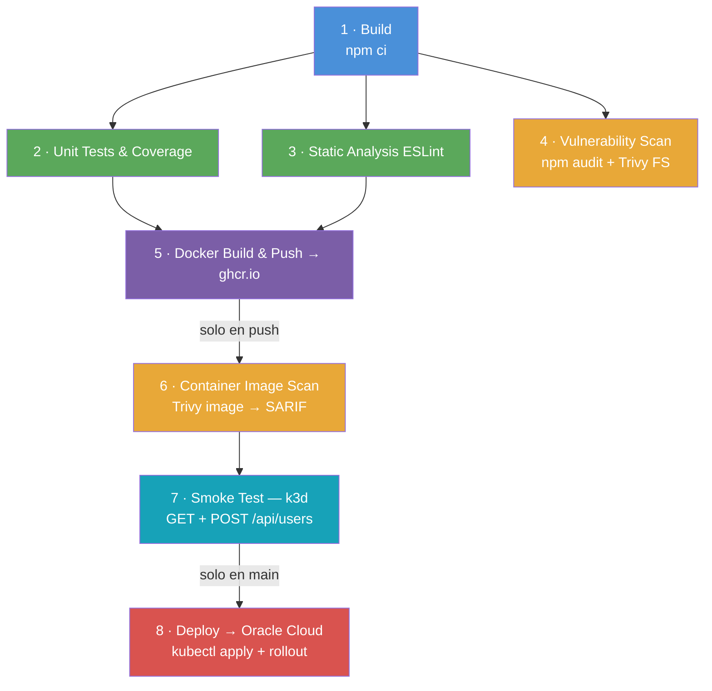

### 3.3 Estrategia de tags de imagen

| Evento | Tags generados |
|---|---|
| push a `main` | `:main` · `:<sha>` · `:latest` |
| push a `develop` | `:develop` · `:<sha>` |
| pull request | `:pr-<número>` (build local, sin push) |

> El tag `:latest` solo se asigna en pushes a `main`.

### 3.4 Seguridad del pipeline

- **Mínimo privilegio:** permisos globales `contents: read`; cada job declara solo lo que necesita.
- **Sin PAT:** se usa el `GITHUB_TOKEN` automático para GHCR.
- **Secret único externo:** `KUBE_CONFIG` (solo para el job de deploy).
- **SARIF:** resultados de Trivy publicados en la pestaña Security del repositorio.

---

## 4. Smoke Test con k3d

Antes de desplegar al cluster real, el pipeline valida la aplicación en un cluster **efímero** creado dentro del runner de GitHub Actions con k3d.

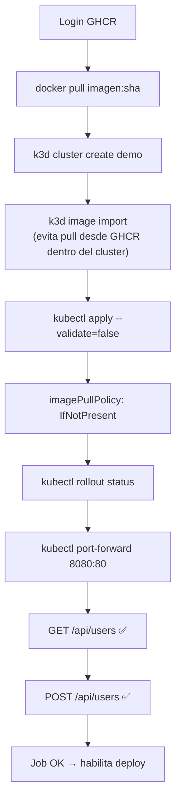

El cluster k3d se destruye automáticamente al terminar el job. No requiere ningún secret ni cluster externo.

---

## 5. Historial de despliegue — decisiones y obstáculos

### 5.1 Intento 1 — k3d local en máquina de desarrollo

**Objetivo:** desplegar localmente para verificar los manifiestos Kubernetes.

**Problema:** la máquina de desarrollo no contaba con recursos suficientes para levantar un cluster k3d funcional con la aplicación corriendo. Las limitaciones de CPU y RAM del entorno local impidieron que los pods levantaran correctamente.

**Decisión:** migrar el despliegue a una VM en la nube con recursos dedicados.

---

### 5.2 Intento 2 — Terraform en Oracle Cloud Free Tier

**Objetivo:** provisionar automáticamente una VM en Oracle Cloud con Terraform e instalar k3s.

**Problemas encontrados:**

| Intento | Shape | Región | Error |
|---|---|---|---|
| 1 | `VM.Standard.E2.1.Micro` (AMD · 1 OCPU · 1GB) | `mx-queretaro-1` | `500 Out of host capacity` |
| 2 | `VM.Standard.A1.Flex` (ARM · 2 OCPUs · 12GB) | `mx-queretaro-1` | `500 Out of host capacity` |
| 3 | `VM.Standard.A1.Flex` (ARM · 2 OCPUs · 12GB) | `sa-saopaulo-1` | `500 Out of host capacity` |

> **Contexto:** el Free Tier de Oracle Cloud tiene alta demanda. Las instancias ARM (A1.Flex) son muy solicitadas por su generosa asignación gratuita (hasta 4 OCPUs + 24GB RAM). Oracle libera capacidad intermitentemente, especialmente en horarios de baja demanda.

**Script de reintento implementado:**
```bash
while ! terraform apply -auto-approve 2>&1 | tee /tmp/tf.log | grep -q "Apply complete"; do
  echo "$(date) — Sin capacidad, reintentando en 3 minutos..."
  sleep 180
done
```

**Decisión:** ante la imposibilidad de automatizar el aprovisionamiento en el momento, se creó la VM manualmente desde la consola de Oracle Cloud, usando la configuración de red del Terraform como referencia.

---

### 5.3 Resolución — VM creada manualmente

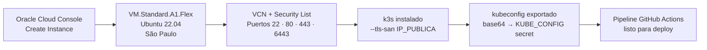

---

## 6. Infraestructura en Oracle Cloud

### 6.1 Terraform (para futuros aprovisionamientos)

```
terraform/
├── provider.tf              # Proveedor OCI v5
├── variables.tf             # Variables configurables
├── network.tf               # VCN, subnet, security list
├── compute.tf               # VM ARM A1.Flex + cloud-init
├── outputs.tf               # IP pública + comandos kubeconfig
├── terraform.tfvars.example # Plantilla (no commitear terraform.tfvars)
└── templates/
    └── cloud-init.yaml      # Instala k3s automáticamente al arrancar
```

```bash
cd terraform
cp terraform.tfvars.example terraform.tfvars
# Completar con OCIDs, fingerprint, clave SSH
terraform init && terraform apply
```

### 6.2 Instalación de k3s en la VM

```bash
ssh ubuntu@IP_VM

# Abrir puertos en firewall de Ubuntu
sudo iptables -I INPUT -p tcp --dport 6443 -j ACCEPT
sudo iptables -I INPUT -p tcp --dport 80 -j ACCEPT
sudo iptables -I INPUT -p tcp --dport 443 -j ACCEPT
sudo apt-get install -y iptables-persistent && sudo netfilter-persistent save

# Instalar k3s con IP pública en el certificado TLS
PUBLIC_IP=$(curl -s ifconfig.me)
curl -sfL https://get.k3s.io | INSTALL_K3S_EXEC="server --tls-san ${PUBLIC_IP}" sh -
```

> El flag `--tls-san` es crítico: incluye la IP pública en el certificado del API server, permitiendo conexiones externas desde GitHub Actions.

### 6.3 Exportar kubeconfig

```bash
# En la VM
sudo chmod 644 /etc/rancher/k3s/k3s.yaml

# En tu máquina local
scp ubuntu@IP_VM:/etc/rancher/k3s/k3s.yaml ~/.kube/config
sed -i 's/127.0.0.1/IP_VM/g' ~/.kube/config
chmod 600 ~/.kube/config

# Generar el secret para GitHub Actions
cat ~/.kube/config | base64 -w 0
```

Cargar en: **GitHub → Settings → Secrets and variables → Actions → `KUBE_CONFIG`**

---

## 7. Deploy a Kubernetes desde GitHub Actions

### 7.1 Flujo del job

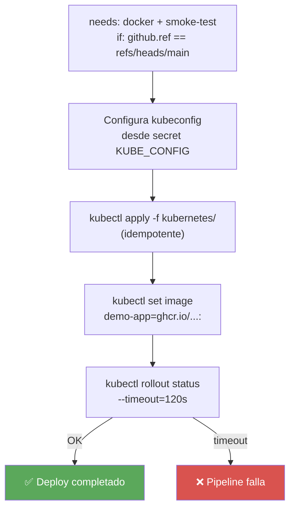

### 7.2 Zero-downtime rolling update

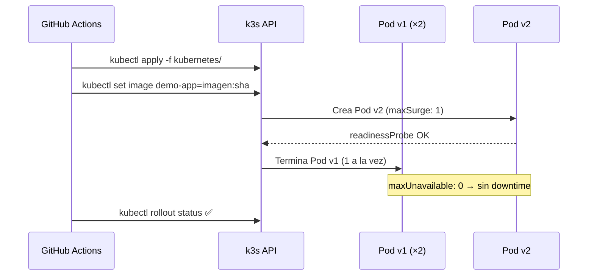

---

## 8. Manifiestos Kubernetes

```
kubernetes/
├── namespace.yaml     # Namespace: demo-app
├── configmap.yaml     # NODE_ENV, DATABASE_NAME
├── secret.yaml        # DATABASE_USER, DATABASE_PASSWORD (base64)
├── pvc.yaml           # PersistentVolumeClaim 1Gi (SQLite data)
├── deployment.yaml    # 2 réplicas · RollingUpdate · liveness/readiness probes
├── service.yaml       # ClusterIP :80 → :8000
├── hpa.yaml           # HPA min 2 / max 5 · CPU 70% · Memoria 80%
├── ingress.yaml       # Traefik · host configurable · bloque TLS preparado
└── cloudflared.yaml   # Quick Tunnel Cloudflare (acceso temporal sin dominio)
```

### Escalamiento horizontal (HPA)

| Parámetro | Valor |
|---|---|
| `minReplicas` | 2 |
| `maxReplicas` | 5 |
| CPU target | 70 % |
| Memoria target | 80 % |
| Ventana scale-up | 60 s |
| Ventana scale-down | 120 s |

> **Nota SQLite:** con múltiples réplicas compartiendo un PVC `ReadWriteOnce` pueden ocurrir conflictos de file-locking bajo carga concurrente. Para producción, migrar a PostgreSQL o MySQL.

---

## 9. Estado actual y pasos pendientes

### Estado actual

La aplicación está desplegada con **IP pública** en Oracle Cloud. El acceso se realiza a través del Cloudflare Quick Tunnel (URL temporal `*.trycloudflare.com`), ya que aún no se ha configurado un dominio propio ni certificados TLS.

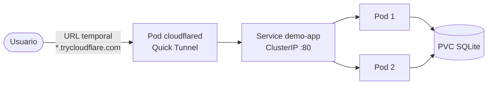

### Roadmap para producción completa

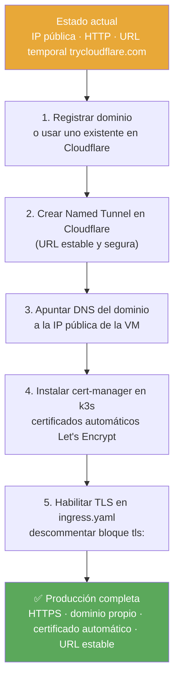

#### Paso 2 — Named Tunnel (reemplaza el Quick Tunnel)

```bash
cloudflared tunnel login
cloudflared tunnel create demo-app
cloudflared tunnel route dns demo-app api.tu-dominio.com
```

Actualizar `kubernetes/cloudflared.yaml` para usar el token del tunnel permanente:
```yaml
env:
  - name: TUNNEL_TOKEN
    valueFrom:
      secretKeyRef:
        name: cloudflared-token
        key: token
args:
  - tunnel
  - --no-autoupdate
  - run
  - --token
  - $(TUNNEL_TOKEN)
```

#### Paso 4 — cert-manager + Let's Encrypt

```bash
kubectl apply -f https://github.com/cert-manager/cert-manager/releases/latest/download/cert-manager.yaml
```

```yaml
apiVersion: cert-manager.io/v1
kind: ClusterIssuer
metadata:
  name: letsencrypt-prod
spec:
  acme:
    server: https://acme-v02.api.letsencrypt.org/directory
    email: tu@email.com
    privateKeySecretRef:
      name: letsencrypt-prod
    solvers:
      - http01:
          ingress:
            ingressClassName: traefik
```

#### Paso 5 — TLS en Ingress

Descomentar en `kubernetes/ingress.yaml` y agregar la anotación:
```yaml
metadata:
  annotations:
    cert-manager.io/cluster-issuer: letsencrypt-prod
spec:
  tls:
    - hosts:
        - api.tu-dominio.com
      secretName: demo-app-tls
  rules:
    - host: api.tu-dominio.com
```

#### Arquitectura final objetivo

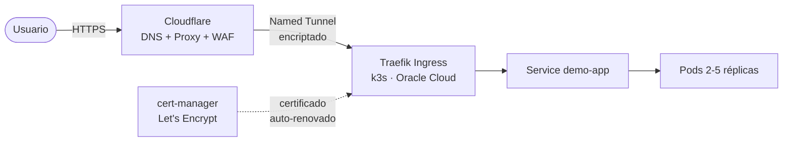
